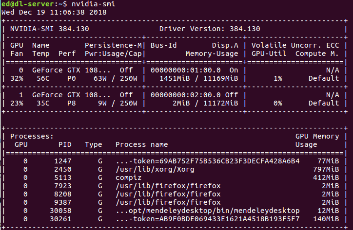

# Quickstart for Training

## Pretrained Model

Within the `./experiments/DenseNet121/7` directory is a pretrained model that will automatically be served by TensorFlow Serving when utilizing other tools and utilities within this repository.

To train a new version of the same model and have it served natively by the TensorFlow Serving instance provided in this repository, please increment your experiments starting with the number `8`.

## Training Options

Currently this codebase supports being trained on a local installation of `>=python3.6` and all of the dependencies defined within the `requirements.txt` file in the root of this repository. Using something like `virtualenv` is out of scope for this document however one could use other tutorials on `virtualenv` to create a separate environment for running this example.

I have also provided a [docker](https://www.docker.com/) image for quick and easy execution of the training process. I will outline steps for both workflows below.

## Dataset

The dataset used in this experiment is [NIH's ChestX-ray14 dataset](https://www.nih.gov/news-events/news-releases/nih-clinical-center-provides-one-largest-publicly-available-chest-x-ray-datasets-scientific-community). This dataset will need to be downloaded locally to wherever you'd like to train your model. 

Here's a link to the [NIH Dropbox](https://nihcc.app.box.com/v/ChestXray-NIHCC) for quick access to download.

Within the `sample_config.ini` file located in this directory is the option to set where this dataset is located on your local filesystem. This configuration parameter is the `image_source_directory` option under the `[DEFAULT]` configuration parameters.

Once this dataset has been downloaded and extracted and you specify the `image_source_directory` in the configuration file you can start the training process of your model.

## Experiment Configuration

The training portion of this project utilized a `sample_config.ini` file to specify specific configuration parameters you may want to define when training a model.

Within the root of this repository there is a `sample_config.ini` provided. Within this file there is a subsection of configuration parameters named `[TRAIN]` that can be modified to set training specific parameters for a given training run of this implementation.

***It is important to note that the docker image outlined below is pre-built with the configurations contained within this repository and if you wanted to modify the parameters within the `sample_config.ini` file and redeploy a training instance utilizing docker, the image will need to be rebuilt using the `Dockerfile.train` file located in the root of this repository***

## Local Training

When training this model on your local `>=python3.6` installation the following steps can be followed : 

1. Define the location of the ChestX-ray14 images using the `image_source_directory` parameter within the `sample_config.ini` file.
2. Define the `output_directory` for this specific run of this experiment.
3. Define a `model_version` that will be used with [TensorFlow Serving](https://www.tensorflow.org/serving/) for serving the results of our model after training. TensorFlow Serving uses integers to track versioning of models, so one should increment this integer for each training cycle of the model.
4. Define the `tensorboard_log_dir` that will be used to store all of the [TensorBoard](https://www.tensorflow.org/guide/summaries_and_tensorboard) logs for use in visualizing the training process
5. Define the `base_model_name` for the base model that you would like to use for training this model. Currently the `Models` class supports the following pre-defined / trained models (VGG16, VGG19, DenseNet121, ResNet50, InceptionV3, InceptionResNetV2, NASNetMobile, NASNetLarge)
6. Define `use_base_model_weights` to allow for using of pre-train model parameters. Otherwise the model will train "from scratch".
7. If resuming training of a previous run of this model, define `use_trained_model_weights` parameter. Otherwise leave as `false`.
8. Define `epochs`, `initial_learning_rate`, and other training specific parameters if you're comfortable with understanding what these parameters do. Otherwise feel free to leave them blank.
9.  Install all of the required dependencies by running `python3.6 -m pip install -r requirements.txt`
10. Run `python3.6 train.py` to start the training process for a new model. If you have a machine that has multiple GPU's and would like to restrict this process to any specific number of GPUs, prepend this command with `CUDA_VISIBLE_DEVICES=0,1...`...`nvidia-smi` is useful in understanding what GPUs are available within your system.

## Docker Image

I have provided a pre-built image for use in training this model. The image is rather large due to the many dependencies that are required, though I'm sure some work could be done on helping understand if there are a bunch of things that could be removed to reduce the image size.

It is important to understand that the docker image that is used for training this model can utilize either CPU and/or GPU's for training. This model is written in TensorFlow which has support for many hardware accelerators on the market today. Arguably the most popular are NVIDIA GPU's.

To understand if you have any NVIDIA GPU's in the workstation that you would like to train this model on, the `nvidia-smi` command-line utility should list if there are any available GPU's. I've included an example image of the output below : 

Steps to get started (GPU) - CPU instructions are similar however one wouldn't use the `--runtime` flag within the docker command.

***As noted above it is important to understand that the container image is prebuilt and has a `sample_config.ini` already present in the image. If one would like to make modifications to the `sample_config.ini` and utilize the docker image for training, the image can be rebuilt using the `Dockerfile.train` file located in the root of this repository***

1. Download the latest [edhenry/chexnet-train](https://cloud.docker.com/u/edhenry/repository/docker/edhenry/chexnet-train) image from [DockerHub](https://hub.docker.com)
2. Run the following command for GPU training `docker run -d --runtime=nvidia -v <local of ChestX-ray14 images on local filesystem>:/opt/chexnet/images -v ~./experiments/:/opt/chexnet/experiments/ edhenry/chexnet-train:0.5`
3. If not using GPU training run the same command but remove the `--runtime=nvidia` flag : `docker run -d -v <local of ChestX-ray14 images on local filesystem>:/opt/chexnet/images -v ~./experiments/:/opt/chexnet/experiments/ edhenry/chexnet-train:0.5`